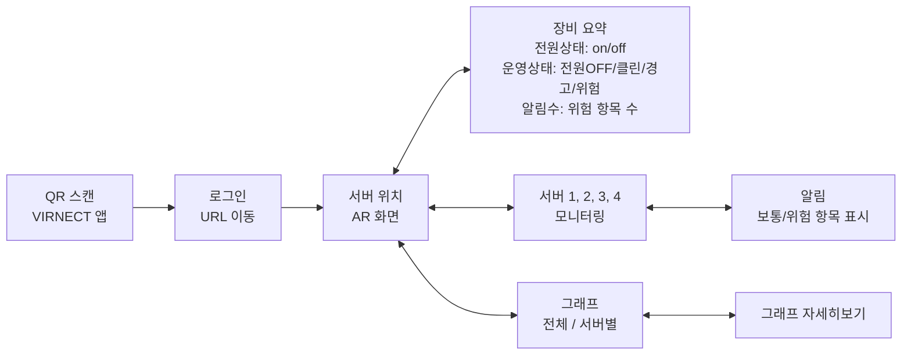
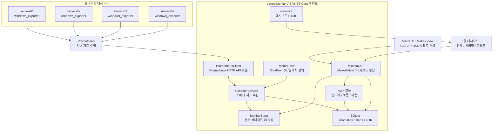
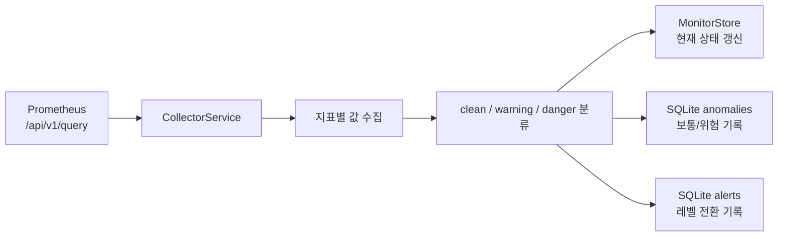

# VIRNECT 시스템 모니터링 프로젝트

VIRNECT 앱과 Make&View를 활용해 서버실 장비 상태를 AR 화면에서 확인하고, 필요한 경우 웹 대시보드로 이동해 서버별 지표와 그래프를 확인하는 통합 모니터링 시스템입니다.

현재 구현은 C# ASP.NET Core 기반의 `VirnectMonitor` 단일 백엔드로 구성되어 있습니다. Prometheus가 수집한 서버 지표를 백엔드가 주기적으로 가져오고, 서버 상태를 `클린 / 보통 / 위험`으로 분류해 Make&View API와 웹 대시보드에 제공합니다.

## 1. 컨셉

이 프로젝트의 목적은 서버실 또는 장비실에 있는 서버 상태를 VIRNECT AR 환경에서 직관적으로 확인하는 것입니다.

- 사용자는 VIRNECT 앱에서 QR을 스캔해 로그인 URL로 이동합니다.
- 로그인 후 AR 화면에서 서버 위치를 기준으로 장비 요약, 서버별 모니터링, 알림, 그래프 화면을 오갑니다.
- Make&View는 백엔드의 GET API에서 JSON 값을 읽어 전원 상태, 위험도, 알림 수, 지표 수치를 표시합니다.
- 웹 대시보드는 전체 서버 상태와 서버별 상세 그래프를 브라우저에서 확인하는 용도로 사용합니다.

핵심 목표는 다음과 같습니다.

| 목표 | 설명 |
|---|---|
| AR 기반 상태 확인 | 서버 위치에서 전원 상태, 위험도, 알림 수를 바로 확인 |
| 단순한 API 연결 | Make&View에서 연결하기 쉬운 GET API와 JSON 필드 제공 |
| 실시간 모니터링 | Prometheus 지표를 주기적으로 수집해 최신 상태 제공 |
| 이상징후 기록 | 보통/위험 상태와 레벨 전환 이벤트를 SQLite에 저장 |
| 웹 그래프 확인 | 전체 서버 또는 서버별 시계열 그래프 제공 |

## 2. 플로우차트



## 3. 구조



주요 파일 구조는 다음과 같습니다.

| 경로 | 역할 |
|---|---|
| `VirnectMonitor/Program.cs` | 서비스 등록, DB 초기화, 라우팅, API 엔드포인트 |
| `VirnectMonitor/Services/CollectorService.cs` | Prometheus 지표 수집 및 상태 분류 |
| `VirnectMonitor/Services/PrometheusClient.cs` | Prometheus instant/range query 호출 |
| `VirnectMonitor/Services/MonitorStore.cs` | 최신 서버 상태와 직전 레벨을 메모리에 저장 |
| `VirnectMonitor/Services/MonitorDatabase.cs` | 이상징후와 알림 이벤트를 SQLite에 저장 |
| `VirnectMonitor/Models/MetricSpec.cs` | 수집 지표, PromQL, 임계치 정의 |
| `VirnectMonitor/Auth/*` | 관리자 계정, 로그인 토큰, 세션, 감사 로그 |
| `VirnectMonitor/wwwroot/index.html` | 전체 서버 대시보드 |
| `VirnectMonitor/wwwroot/server.html` | 서버별 상세 대시보드 |
| `VirnectMonitor/wwwroot/api-reference.html` | API 레퍼런스 페이지 |

## 4. 백엔드 기능 및 구조 설명

### 모니터링 수집

백엔드는 `CollectorService`를 Hosted Service로 실행합니다. 기본 설정 기준으로 5초마다 Prometheus를 조회하고, 조회 결과를 서버별 현재 상태로 정리합니다.



수집 대상 지표와 백엔드 임계치는 다음과 같습니다.

| id | 이름 | 단위 | 보통(warn) | 위험(danger) |
|---|---|---|---:|---:|
| `cpu` | CPU 사용률 | `%` | 70 | 90 |
| `memory` | 메모리 사용률 | `%` | 70 | 90 |
| `disk` | 디스크 사용률(C:) | `%` | 80 | 90 |
| `disk_io` | 디스크 I/O(C:) | `B/s` | 50,000,000 | 100,000,000 |
| `net_recv` | 네트워크 수신 | `B/s` | 50,000,000 | 100,000,000 |
| `net_sent` | 네트워크 송신 | `B/s` | 50,000,000 | 100,000,000 |

분류 기준은 다음과 같습니다.

| 상태 | key | levelCode | 설명 |
|---|---:|---:|---|
| 클린 | `clean` | `0` | 임계치 미만 |
| 보통 | `warning` | `1` | warn 이상, danger 미만 |
| 위험 | `danger` | `2` | danger 이상 |

단, Make&View에서 바로 연결하는 `/api/server/{server}`와 `/api/metric/{server}/{metric}`의 운영/상태 코드는 전원 OFF까지 포함해 아래처럼 사용합니다.

| 코드 | 의미 |
|---:|---|
| `0` | 전원OFF |
| `1` | 클린 |
| `2` | 경고 |
| `3` | 위험 |

`/api/server/{server}/metrics`의 지표별 `status` 값은 Make&View 조건 연결을 위해 `1 - levelCode`로 계산됩니다.

| status | 의미 |
|---:|---|
| `1` | 클린 |
| `0` | 보통 |
| `-1` | 위험 |

### 전원 상태

서버 전원 상태는 Prometheus의 `up{job="windows-servers"}` 쿼리로 판단합니다.

| 필드 | 값 | 의미 |
|---|---:|---|
| `powercode` | `1` | 서버 켜짐 |
| `powercode` | `0` | 서버 꺼짐 |

### 인증

인증 기능은 `Auth` 모듈에 분리되어 있습니다.

- 최초 실행 시 관리자 계정이 없으면 `/setup`에서 관리자 계정을 생성합니다.
- 로그인 시작 시 랜덤 토큰을 만들고 DB에는 토큰 원문이 아닌 `token_hash`를 저장합니다.
- 비밀번호는 PBKDF2-SHA256으로 해시하여 저장합니다.
- 승인된 세션이 살아 있는 동안 `/server`, `/server-01` 같은 대시보드 화면에 접근할 수 있습니다.
- 세션과 로그인 시도 기록은 SQLite에 저장됩니다.

### 웹 대시보드

웹 대시보드는 정적 HTML 파일과 API를 함께 사용합니다.

| 화면 | 주소 | 설명 |
|---|---|---|
| 전체 대시보드 | `/server` | 전체 서버 상태, 전체 그래프, 서버 탭 |
| 서버별 대시보드 | `/server-01` | 서버 1대의 지표 카드와 그래프 |
| 관리자 모니터 | `/admin` | 인증 세션과 로그인 감사 로그 |
| API 레퍼런스 | `/api-reference.html` | API 설명 페이지 |

## 5. API 이름 및 주소 정리

Base URL은 실행 환경에 따라 달라집니다.

| 환경 | 예시 |
|---|---|
| 로컬 | `http://127.0.0.1:47892` |
| Docker 내부 | `http://virnect-monitor:47892` |
| 외부 터널/운영 | `https://monitor.yongun.shop/` |

서버 이름과 지표 이름은 다음 값을 기준으로 사용합니다.

| 구분 | 값 |
|---|---|
| 서버 | `server-01`, `server-02`, `server-03`, `server-04` |
| 지표 | `cpu`, `memory`, `disk`, `disk_io`, `net_recv`, `net_sent` |

### 화면 페이지

| 이름 | Method | 주소 | 설명 |
|---|---|---|---|
| 로그인 시작 | GET | `/` | 셋업 또는 로그인 흐름으로 이동 |
| 로그인 시작 | GET | `/login/start` | `/auth/start`와 같은 진입점 |
| 로그인 시작 | GET | `/auth/start` | 로그인 토큰 발급 후 로그인 화면으로 이동 |
| 전체 대시보드 | GET | `/server` | 전체 서버 모니터링 화면 |
| 서버별 대시보드 | GET | `/server-01` | `server-01` 상세 화면 |
| 서버별 대시보드 | GET | `/server-02` | `server-02` 상세 화면 |
| 서버별 대시보드 | GET | `/server-03` | `server-03` 상세 화면 |
| 서버별 대시보드 | GET | `/server-04` | `server-04` 상세 화면 |
| 관리자 모니터 | GET | `/admin` | 인증 세션/로그인 감사 확인 |
| API 문서 | GET | `/api-reference.html` | API 레퍼런스 HTML |

### 인증 API

| 이름 | Method | 주소 | 설명 |
|---|---|---|---|
| 인증 시작 | POST | `/auth/start` | JSON으로 로그인 토큰과 로그인 URL 발급 |
| 최초 관리자 등록 화면 | GET | `/setup` | 관리자 계정이 없을 때 등록 화면 |
| 최초 관리자 등록 | POST | `/setup` | 관리자 계정 생성 |
| 로그인 화면 | GET | `/login?token={token}` | 토큰 기반 로그인 페이지 |
| 로그인 결과 | GET | `/login/result?token={token}` | 로그인 결과 화면 |
| 로그인 처리 | POST | `/auth/login` | ID/PW 로그인 처리 |
| 토큰 상태 조회 | GET | `/auth/status/{token}` | 특정 토큰 상태 확인 |
| 현재 인증 조회 | GET | `/auth/current?token={token}` | 현재 인증 상태 확인 |
| Make&View 인증 확인 | GET | `/auth/current-once?token={token}` | 인증 여부를 `value`로 반환 |
| 세션 목록 | GET | `/auth/sessions?limit=20` | 최근 인증 세션 목록 |
| 로그인 감사 목록 | GET | `/auth/login-audits?limit=20` | 최근 로그인 시도 목록 |

### 모니터링 API

| 이름 | Method | 주소 | 설명 |
|---|---|---|---|
| 헬스체크 | GET | `/api/health` | 수집 상태, Prometheus 주소, 서버 목록 |
| 지표 정의 | GET | `/api/metrics` | 지표 이름, 단위, 임계치 |
| 전체 상태 | GET | `/api/status` | 모든 서버 현재 스냅샷 |
| 장비 요약 | GET | `/api/server/{server}` | Make&View 장비요약용 짧은 JSON |
| 서버 상세 지표 | GET | `/api/server/{server}/metrics` | 선택/디버깅용 전원 상태, 알림 수, 지표 목록 |
| 지표 현재값 | GET | `/api/metric/{server}/{metric}` | 특정 서버의 특정 지표값 |
| 서버 위험도 | GET | `/api/alert/{server}` | 서버 종합 위험도 |
| 서버 이상징후 | GET | `/api/alert/{server}/issues` | 보통/위험 지표 목록 |
| 전체 위험도 | GET | `/api/alert` | 전체 서버 중 가장 높은 위험도 |
| 서버별 그래프 | GET | `/api/history/{server}/{metric}?minutes=60&step=15` | 서버 1대의 시계열 |
| 전체 그래프 | GET | `/api/history/{metric}?minutes=60&step=15` | 모든 서버의 특정 지표 시계열 |
| 이상징후 이력 | GET | `/api/anomalies?limit=100&server=&metric=` | SQLite 이상징후 기록 |
| 알림 이력 | GET | `/api/alerts?limit=50&server=` | SQLite 알림 기록 |

### Make&View 연결용 JSON 필드

Make&View에서는 아래 표의 `JSON 필드`를 응답 필터로 연결하면 됩니다.

| 화면/기능 | API | JSON 필드 | 타입 | 값 예시 | Make&View 연결 용도 |
|---|---|---|---|---|---|
| 로그인 확인 | `GET /auth/current-once?token={token}` | `value` | number | `1` | `1`이면 인증 성공 |
| 장비 요약 | `GET /api/server/server-01` | `powercode` | number | `1` | `1=on`, `0=off` |
| 장비 요약 | `GET /api/server/server-01` | `alertNum` | number | `2` | 보통/위험 항목 개수 |
| 장비 요약 | `GET /api/server/server-01` | `operationCode` | number | `3` | `0=전원OFF`, `1=클린`, `2=경고`, `3=위험` |
| 장비 요약 | `GET /api/server/server-01` | `checkMessage` | string | `CPU 사용률, 디스크 사용률 확인 필요` | 확인 필요 한 줄 요약 |
| 서버 위험도 | `GET /api/alert/server-01` | `value` | number | `2` | 보조 조회: `0=클린`, `1=보통`, `2=위험` |
| 서버 위험도 | `GET /api/alert/server-01` | `level` | string | `danger` | 보조 조회 상태 키 |
| 서버 위험도 | `GET /api/alert/server-01` | `levelText` | string | `위험` | 보조 조회 상태 표시 텍스트 |
| 지표 수치 | `GET /api/metric/server-01/cpu` | `powercode` | number | `1` | `1=on`, `0=off` |
| 지표 수치 | `GET /api/metric/server-01/cpu` | `display` | string | `83.2%` | 화면 텍스트 표시 |
| 지표 수치 | `GET /api/metric/server-01/cpu` | `levelCode` | number | `2` | `0=전원OFF`, `1=클린`, `2=경고`, `3=위험` |
| 알림 목록 | `GET /api/alert/server-01/issues` | `count` | number | `2` | 알림 개수 |
| 알림 목록 | `GET /api/alert/server-01/issues` | `alerts[0].message` | string | `CPU 사용률 83.2% 보통` | 알림 문구 표시 |
| 알림 목록 | `GET /api/alert/server-01/issues` | `alerts[0].metric` | string | `cpu` | 어떤 지표인지 구분 |
| 알림 목록 | `GET /api/alert/server-01/issues` | `alerts[0].value` | number | `83.2` | 알림 수치 |
| 알림 목록 | `GET /api/alert/server-01/issues` | `alerts[0].levelCode` | number | `1` | 알림 심각도 조건 |

Make&View에서 자주 쓰는 조건 예시는 다음과 같습니다.

| 목적 | API | 필드 | 조건 |
|---|---|---|---|
| 로그인 성공 시 다음 화면 이동 | `/auth/current-once?token={token}` | `value` | `{값} > 0` |
| 서버 전원 ON 표시 | `/api/server/server-01` | `powercode` | `{값} == 1` |
| 서버 전원 OFF 표시 | `/api/server/server-01` | `powercode` | `{값} == 0` |
| 알림 있음 표시 | `/api/server/server-01` | `alertNum` | `{값} > 0` |
| 장비 운영상태 경고 이상 표시 | `/api/server/server-01` | `operationCode` | `{값} >= 2` |
| 장비 운영상태 위험 표시 | `/api/server/server-01` | `operationCode` | `{값} >= 3` |
| 확인 필요 문구 표시 | `/api/server/server-01` | `checkMessage` | 텍스트 표시 |
| 서버 위험 상태 보조 조회 | `/api/alert/server-01` | `value` | `{값} >= 2` |
| 특정 지표 경고 이상 표시 | `/api/metric/server-01/cpu` | `levelCode` | `{값} >= 2` |
| 특정 지표 위험 표시 | `/api/metric/server-01/cpu` | `levelCode` | `{값} >= 3` |
| 특정 지표 수치 표시 | `/api/metric/server-01/cpu` | `display` | 텍스트 표시 |

Make&View 화면별 추천 연결은 다음과 같습니다.

| 화면 | API | 사용할 필드 |
|---|---|---|
| 장비요약 | `/api/server/server-01` | `powercode`, `operationCode`, `checkMessage`, `alertNum` |
| CPU | `/api/metric/server-01/cpu` | `powercode`, `display`, `levelCode` |
| 메모리 | `/api/metric/server-01/memory` | `powercode`, `display`, `levelCode` |
| 디스크 | `/api/metric/server-01/disk` | `powercode`, `display`, `levelCode` |
| 디스크 I/O | `/api/metric/server-01/disk_io` | `powercode`, `display`, `levelCode` |
| 네트워크 수신 | `/api/metric/server-01/net_recv` | `powercode`, `display`, `levelCode` |
| 네트워크 송신 | `/api/metric/server-01/net_sent` | `powercode`, `display`, `levelCode` |

최종 Make&View 연결용 JSON 예시는 다음과 같습니다.

```json
GET /api/server/server-01

{
  "server": "server-01",
  "powercode": 1,
  "operationCode": 3,
  "checkMessage": "CPU 사용률, 디스크 사용률 확인 필요",
  "alertNum": 2
}
```

```json
GET /api/metric/server-01/cpu

{
  "powercode": 1,
  "display": "83.2%",
  "levelCode": 2
}
```

전원이 꺼진 서버의 지표 API는 다음처럼 응답합니다.

```json
{
  "powercode": 0,
  "display": "전원 OFF",
  "levelCode": 0
}
```

### 선택/디버깅용 JSON 필드

현재 Make&View 프론트에서는 필수로 쓰지 않지만, 브라우저 확인이나 디버깅에 사용할 수 있는 JSON 필드는 다음과 같습니다.

| 기능 | API | 주요 JSON 필드 | 설명 |
|---|---|---|---|
| 전체 상태 | `GET /api/status` | `ts`, `tsText`, `servers` | 전체 서버 현재 상태 |
| 전체 상태 | `GET /api/status` | `servers.server-01.metrics.cpu.value` | 특정 서버 CPU 현재값 |
| 전체 상태 | `GET /api/status` | `servers.server-01.overallCode` | 서버 종합 상태 코드 |
| 서버 상세 | `GET /api/server/server-01/metrics` | `powercode`, `operationCode`, `checkMessage`, `alertNum`, `updatedAt`, `metrics` | 서버 상세 카드 데이터 |
| 서버별 그래프 | `GET /api/history/server-01/cpu?minutes=60&step=15` | `points` | `[unix초, 값]` 배열 |
| 전체 그래프 | `GET /api/history/cpu?minutes=60&step=15` | `series[].server`, `series[].points` | 서버별 멀티라인 그래프 |
| 이상징후 이력 | `GET /api/anomalies?limit=100` | `id`, `server`, `metric`, `value`, `level`, `createdAt` | 보통/위험 기록 |
| 알림 이력 | `GET /api/alerts?limit=50` | `id`, `server`, `metric`, `level`, `prevLevel`, `message`, `createdAt` | 레벨 전환 기록 |

## 실행

로컬 실행 예시는 다음과 같습니다.

```powershell
dotnet run --project VirnectMonitor -c Release --urls http://127.0.0.1:47892
```

Docker Compose 실행 예시는 다음과 같습니다.

```powershell
docker compose up -d --build
```

Docker Compose는 Prometheus가 이미 만든 외부 네트워크 `prometheus_default`에 연결하는 구성을 사용합니다. Cloudflare Tunnel을 사용할 경우 `.env`에 `TUNNEL_TOKEN`을 설정합니다.

주요 설정은 `VirnectMonitor/appsettings.json` 또는 환경변수로 변경합니다.

| 설정 | 기본값 | 설명 |
|---|---|---|
| `Monitor:PrometheusUrl` | `http://127.0.0.1:9090` | Prometheus 주소 |
| `Monitor:IntervalSeconds` | `5` | 수집 주기 |
| `Monitor:DbPath` | `monitoring.db` | 모니터링 SQLite DB 경로 |
| `Monitor:GroupLabel` | `server` | 서버 구분 라벨 |
| `Monitor:UpQuery` | `up{job="windows-servers"}` | 전원 상태 판정 쿼리 |
| `Auth:DatabasePath` | `Data/auth.db` | 인증 SQLite DB 경로 |
| `Auth:ServerSecret` | `development-only-change-me` | 토큰 해시용 비밀값 |
| `Auth:LoginExpiresMinutes` | `10` | 로그인 토큰 유효 시간 |
| `Auth:AuthDurationMinutes` | `5` | 인증 유지 시간 |
| `Auth:MaxFailureCount` | `5` | 로그인 실패 허용 횟수 |

운영 환경에서는 반드시 `Auth:ServerSecret`을 안전한 값으로 변경해야 합니다.
